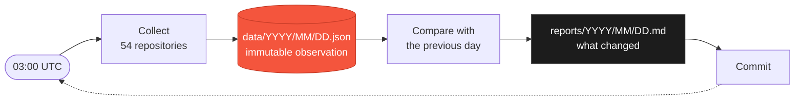

<div align="center">


# ghistory

**A daily, permanent record of how the GitHub ecosystem changes.**

[](../../actions/workflows/ci.yml)
[](../../actions/workflows/daily.yml)
[](config/repositories.txt)
[](LICENSE)

[Browse the data](data) · [Read the reports](reports) · [Documentation](docs)

</div>

---

## The idea

GitHub only ever shows you *now*. A repository has 115,528 stars today; what it had
last March is gone unless somebody wrote it down.

Every day at 03:00 UTC, ghistory writes it down. It records a fixed set of
repositories, compares the numbers against the previous day, writes a short report
about what moved, and commits both back here.

The repository *is* the database. No server, no dashboard, no account — just a
directory of dated JSON files that grows by one entry a day and is never rewritten.



The first day is almost useless. The first month is interesting. The first year is
something you cannot go back and recreate.

---

## What comes out of it

Two files a day.

### A report, for people

> ### ghistory — 2026-08-18
>
> Compared with 2026-08-17.
>
> **Fastest growing**
>
> | # | Repository | Stars | Change |
> | --: | --- | --: | --: |
> | 1 | ggml-org/llama.cpp | 124,221 | +2 |
> | 2 | django/django | 88,433 | +1 |
> | 3 | git/git | 62,601 | +1 |

Alongside that: new releases, repositories that were archived or relicensed or
renamed, the language spread across the tracked set, and an explicit list of
anything that could not be collected that day.

### A snapshot, for machines

```json
{
  "date": "2026-08-17",
  "status": "complete",
  "counts": { "requested": 54, "ok": 54, "failed": 0 },
  "repositories": [
    {
      "slug": "rust-lang/rust",
      "full_name": "rust-lang/rust",
      "status": "ok",
      "stars": 115528,
      "forks": 15423,
      "open_issues": 12722,
      "subscribers": 1550,
      "language": "Rust",
      "license": "Apache-2.0",
      "archived": false,
      "releases": [{ "tag_name": "1.97.1", "published_at": "2026-07-16T12:29:15Z" }]
    }
  ]
}
```

Every field is documented in **[docs/data-format.md](docs/data-format.md)**.

---

## Working with the data

Plain JSON on a predictable path, so the dataset is queryable with tools you
already have.

```bash
# What did Rust look like on a given day?
jq '.repositories[] | select(.slug == "rust-lang/rust") | .stars' data/2026/08/17.json

# Star history for one repository, across everything ever collected
for f in data/*/*/*.json; do
  jq -r --arg s "rust-lang/rust" \
    '[.date, (.repositories[] | select(.slug == $s) | .stars)] | @tsv' "$f"
done

# Which days were incomplete, and why?
jq -r 'select(.status != "complete")
       | .date + ": " + ([.repositories[] | select(.status == "error") | .slug] | join(", "))' \
   data/*/*/*.json
```

Clone the repository and the entire history is on your disk. Nothing to sign up for.

---

## What this is not

Being clear about the limits is what makes the numbers worth keeping.

- **An observation log, not GitHub's truth.** A value is what the collector saw at
  one moment on one day. A repository that went 10,000 → 10,500 → 10,200 between two
  runs is recorded as +200, and the spike is simply not in the data.
- **54 repositories, not GitHub.** The list is [hand-picked](config/repositories.txt)
  and biased toward large, long-lived projects. Language counts describe *that set*
  and nothing wider.
- **Missing data stays missing.** A repository that could not be fetched is stored
  with an error code and no numbers. Never zero, and the report always names it.
- **History is never rewritten.** Old snapshots are not corrected when GitHub's
  current answer disagrees with them. They record what was observed that day.

---

## Documentation

|  |  |
| --- | --- |
| **[Data format](docs/data-format.md)** | Snapshot schema, every field, error codes, versioning |
| **[Architecture](docs/architecture.md)** | How a run works, and the guarantees it holds to |
| **[Configuration](docs/configuration.md)** | Tracked repositories, settings, tokens, CLI reference |
| **[Operations](docs/operations.md)** | Running it, the automation, and repairing a bad day |

---

## Running it yourself

```bash
git clone https://github.com/PeacexF/ghistory
cd ghistory
echo "GITHUB_TOKEN=your_token" > .env   # no scopes needed; public data only
./run.sh --dry-run                      # collect and print, write nothing
```

See [Configuration](docs/configuration.md) for the token and settings, and
[Operations](docs/operations.md) for running it on a schedule.

---

## License

[MIT](LICENSE) · Data collected from the public GitHub REST API.
