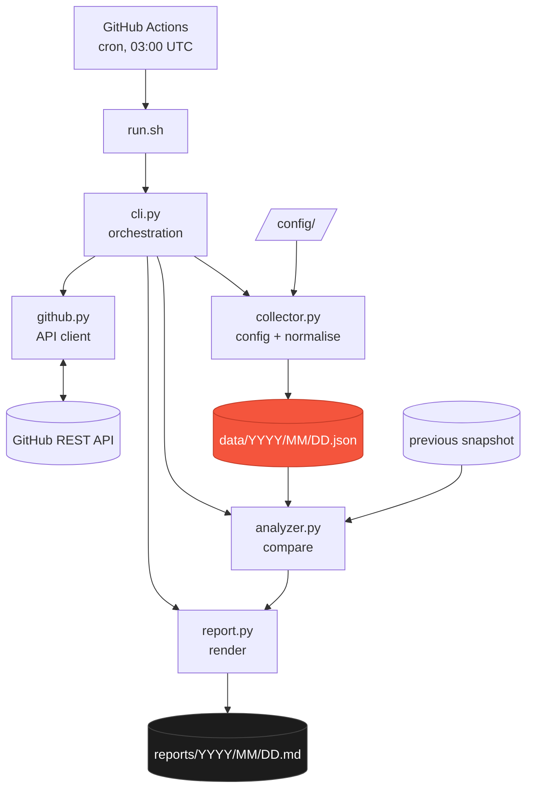
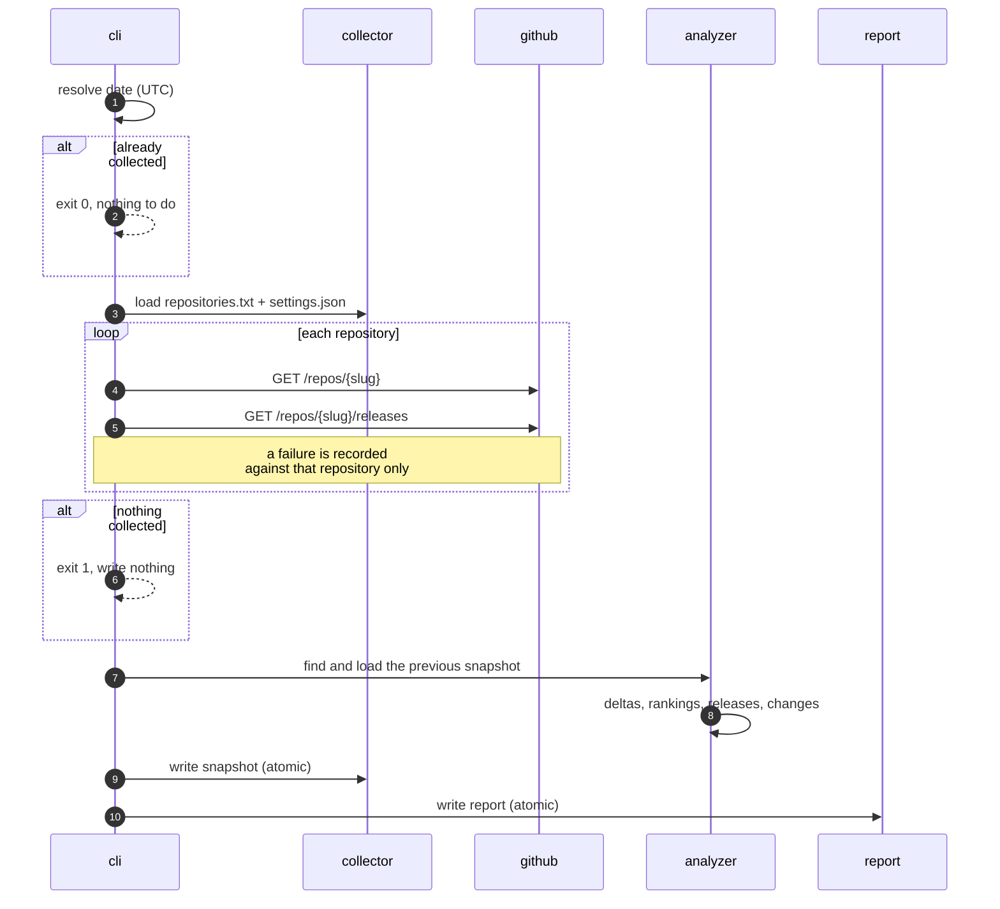

# Architecture

ghistory is a scheduled batch job with four stages and no moving parts between runs.
There is no database, no service, and no state outside the git repository.

## Modules

| Module | Responsibility | Knows about |
| --- | --- | --- |
| `github.py` | HTTP, auth, retries, rate limits. Returns raw API payloads. | `requests` |
| `collector.py` | Reads config, normalises payloads, writes snapshots. | the snapshot schema |
| `analyzer.py` | Pure comparison of two snapshots. No I/O beyond loading. | snapshots only |
| `report.py` | Renders an `Analysis` to Markdown. | nothing else |
| `storage.py` | Atomic file writes. | the filesystem |
| `cli.py` | Argument parsing and orchestration. | all of the above |

The dependency direction is one-way. `analyzer.py` never imports `github.py`, so
comparison logic can be exercised without an HTTP layer at all, and `report.py`
receives a finished `Analysis` — it makes no decisions about what is interesting.

## A run, end to end

The order matters at the end: the snapshot is written before the report, because the
snapshot is the irreplaceable artefact. A report can always be rebuilt later with
`--report-only`; an observation missed at 03:00 UTC is gone.

## Guarantees

**One snapshot per date.** An existing file short-circuits the run *before* any API
call. Re-running is free and harmless. `--repair` is the only way to overwrite.

**Writes are atomic.** Files are written to a temporary file in the destination
directory, `chmod`ed to 0644, then `os.replace`d into place. A crash mid-write leaves
the previous file untouched; there is no window in which a snapshot is half-written.

**Failure is per-repository.** A 404, a malformed payload, or an exhausted quota
fails one entry. The rest of the run continues and the day is still recorded.

**Total failure writes nothing.** If no repository could be observed, the run exits
non-zero and no file is created, so the workflow fails loudly rather than committing
an empty day.

**Yesterday cannot break today.** If the previous snapshot is missing or unreadable,
the run warns, writes today's observation anyway, and produces a report without a
comparison. A corrupt old file costs the report a section, never the data.

## Failure handling

| Situation | Response |
| --- | --- |
| 5xx, timeout, connection error | 3 attempts, 1s → 2s backoff |
| 404, 401, 403, 451 | no retry — the answer will not change |
| Quota exhausted | remaining repositories fail fast without being requested |
| Secondary limit with `Retry-After` | waited out up to 60s, then given up on |
| 200 with a non-JSON body | that repository fails as `invalid_response` |
| Field of the wrong type | that repository fails as `invalid_response` |

Once the API reports zero remaining quota, the client stops sending requests until
the reset timestamp passes. The rest of the run finishes immediately with
`rate_limit` entries instead of spending several minutes collecting 403s.

## Exit codes

| Code | Meaning |
| --- | --- |
| `0` | Snapshot written, or one already existed for that date |
| `1` | Nothing collected, bad configuration, or missing token |
| `2` | Invalid command-line arguments |

The daily workflow only reaches its commit step on `0`, so a failed collection can
never produce a commit.

## Design constraints

- **Small, boring dependencies.** One runtime dependency, `requests`.
- **Deterministic output.** Sorted keys, sorted entries, no wall-clock in reports.
- **Reproducible reports.** Any report can be regenerated from stored snapshots.
- **No accumulating state.** The only state is the files in git.

Further reading: [Data format](data-format.md) · [Configuration](configuration.md) ·
[Operations](operations.md)
