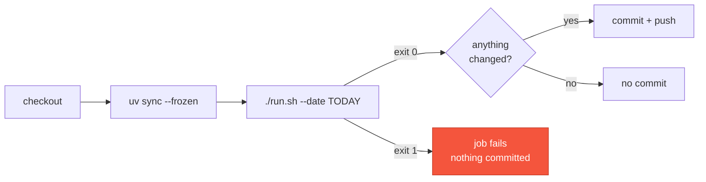

# Operations

How the daily run works in production, and what to do when a day goes wrong.

---

## The automated run

`.github/workflows/daily.yml` runs at 03:00 UTC and can also be dispatched manually.



Three properties worth knowing:

- **The date is fixed once**, at the start of the job, and reused for the commit
  message. A run that crosses midnight UTC cannot label the file one day and the
  commit another.
- **No empty commits.** If nothing changed — typically because the day's snapshot was
  already collected — the job finishes without committing.
- **A failed collection never commits.** The commit step is not reached on a non-zero
  exit.

03:00 UTC rather than midnight: the top of the hour at 00:00 is the most contended
slot on GitHub's scheduler, and delays there are routine.

### Requirements

The repository needs Actions enabled, and that is all — `secrets.GITHUB_TOKEN` is
injected automatically and the workflow requests `contents: write` for itself. The
repository-level "Workflow permissions" setting is a *default* that a workflow's own
`permissions:` block adjusts, so leaving it read-only is both safe and correct.

Scheduled workflows on public repositories are disabled after 60 days without
repository activity. The daily commits are themselves activity, so an operating
collector keeps its own schedule alive — but a collector that has been broken for two
months will also have quietly lost its cron.

---

## Reading a run

```text
ghistory 0.1.0
Date: 2026-08-17
Repositories: 54
Successful:   54
Failed:       0
Status: COMPLETE
Top growth:
  1. ggml-org/llama.cpp +2 stars
New releases: 0
Significant changes: 0
Wrote data/2026/08/17.json
Wrote reports/2026/08/17.md
```

`Status: PARTIAL` means some repositories failed; each is listed with its error code,
and the report carries an **Incomplete collection** section naming them. That is a
normal, recorded outcome — not something to repair unless the cause was transient.

---

## Recipes

### Rebuild a report

Reports are derived, so this is always safe and never touches the API.

```bash
./run.sh --report-only --date 2026-08-17
```

Use it when a report is missing, when you have changed the report format and want to
regenerate one, or after repairing a snapshot.

### Repair a bad day

Only when the *observation* was faulty — a rate-limited run, a network outage
recorded as failures. This overwrites an immutable file, so it is deliberate.

```bash
./run.sh --repair --date 2026-08-17
```

Two consequences:

1. The new values are what GitHub reports **now**, not what it would have reported at
   the original collection time. Repairing days later records today's numbers under
   an old date.
2. The *next* day's report is now stale, because it was rendered against the old
   version. Regenerate it:

```bash
./run.sh --report-only --date 2026-08-18
```

### Backfill a missed day

You cannot. GitHub exposes no historical star counts, so a day that was not collected
stays absent. Collecting it under an old date would record today's numbers as if they
were that day's — a fabrication, not a recovery.

A gap is handled correctly on its own: the next successful run compares against the
last good snapshot, not the missing one, and its report says which date that was.

### Add or remove repositories

Edit [`config/repositories.txt`](../config/repositories.txt) and commit. Additions
begin collecting on the next run with no backfill and no release-history dump;
removals leave all past snapshots untouched. See
[Configuration](configuration.md#adding-and-removing).

---

## Troubleshooting

| Symptom | Cause | Response |
| --- | --- | --- |
| `error: GITHUB_TOKEN is not set` | No `.env`, no environment variable | See [Configuration](configuration.md#token) |
| Many `rate_limit` entries | Quota exhausted mid-run | Wait for the reset, then `--repair` if the day matters |
| `unauthorized` on every repository | Token expired or revoked | Issue a new one; no scopes required |
| One repository always `not_found` | Deleted, made private, or a typo | Fix or remove the line |
| `unavailable` on a repository | 451, usually a DMCA takedown | Nothing to do; it is recorded honestly |
| `error: unknown setting(s): …` | Typo in `settings.json` | The message names the key |
| `warning: … invalid JSON` | An older snapshot is corrupt | Today's data is still written; the report just loses its comparison |
| Workflow push fails with 403 | Actions cannot write to the repository | Settings → Actions → General → Workflow permissions |

### Rate limit budget

Each repository costs two requests, one for metadata and one for releases. At 54
repositories that is 108 requests per run, against 5,000/hour for a personal token
and 1,000/hour for the Actions token. There is a wide margin; you would need several
hundred repositories before the daily run came close.

When the limit is reached anyway, the client stops sending requests until the reset
timestamp passes rather than collecting 403s, so a rate-limited run finishes quickly
with the remaining repositories marked `rate_limit`.

---

## Verifying the dataset

```bash
# Every day ever collected, with its status
jq -r '[.date, .status, (.counts.ok | tostring)] | @tsv' data/*/*/*.json

# Days that were not complete
jq -r 'select(.status != "complete") | .date' data/*/*/*.json

# Confirm no snapshot claims a metric for a failed repository
jq -r '.repositories[] | select(.status == "error" and has("stars")) | .slug' data/*/*/*.json
```

The last query should always print nothing. If it ever prints a slug, a failed
observation has been recorded as data — the one invariant the whole dataset rests on.

See also: [Data format](data-format.md) · [Architecture](architecture.md) ·
[Configuration](configuration.md)
